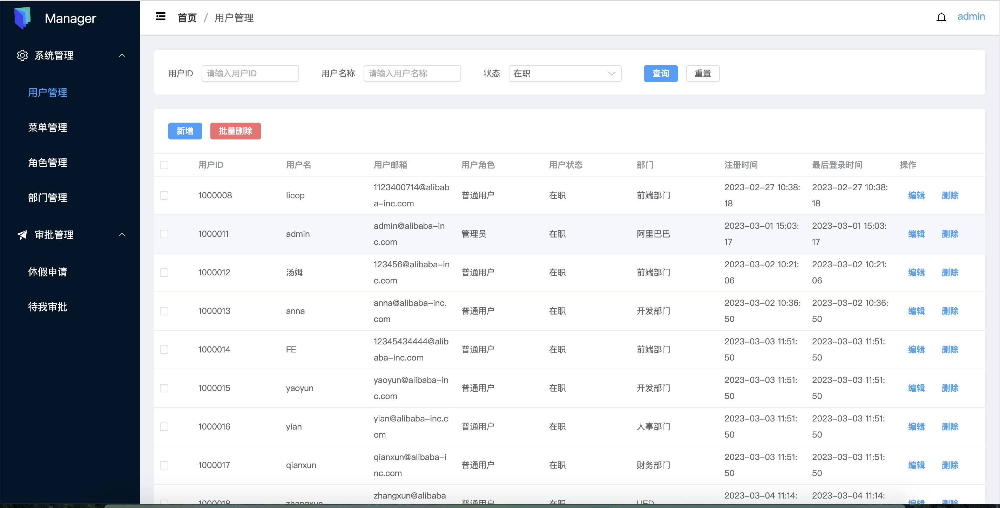

# vue-manager-fe

Vue 实现公司管理中后台基础功能，使用 RBAC 权限设计模式，包含用户管理、菜单管理、角色管理、部门管理、休假申请和审批功能。

**技术栈**

- 前端框架：Vue3.0
- 路由管理：vue-router
- 用户界面：ElementPlus
- 全局状态管理：vuex
- 网络请求：Axios
- 工程化管理：Vite
- 接口 MOCK 平台：https://www.fastmock.site/#/

管理员用户： admin， 密码： 123456

[项目后端代码](https://github.com/licop/vue-manager-server)
